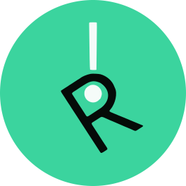

<div align="center">
	<br/>
	
	<br/>
	<div><b>The core execution layer of the RealDriss decentralized service.</b></div>
	<br/>
	<a href="https://github.com/godwnwaswa/drisschain/blob/master/LICENSE.md"></a>
	<a href="https://github.com/godwnwaswa/drisschain/releases"></a>
	<a href="https://snyk.io/test/github/godwnwaswa/drisschain"></a>
	<a href="https://github.com/godwnwaswa/drisschain/stargazers"></a>
	<a href="https://github.com/godwnwaswa/drisschain/blob/main/.github/PULL_REQUEST_TEMPLATE.md"></a>
</div>

## What is Drisschain?

A smart contract blockchain network that powers RealDriss. RealDriss is a decentralized e-commerce marketplace for buyers and sellers to create, list and exchange products effortlessly.


## Setup a node

### Dependencies 

* NodeJS v16 or higher.
* Latest release of npm.

### Requirements

A system that is running Windows, Linux, or MacOS with a dual-core CPU and 8GB of RAM with a mediocre SSD/HDD should be enough.

### Installation

First, download the latest release from: https://github.com/godwnwaswa/drisschain/releases.

Extract the zip file, in the `Drisschain` folder, open up your terminal and install the required packages through `npm`:

```
npm install
```

### Generate your keys

If you haven't had a Drisschain key pair before, hop over to `./utils/`, on the command line, type:

```
node keygen.js
```

And it will generate an address, a public key and a private key for you.

### Configure your node

In `config.json`, change the props for your needs:

```js
{
    "PORT": /*PORT that your node will run on, default is 3000*/,
    "RPC_PORT": /*PORT that the RPC server will run on, default is 5000*/,
    "PEERS": /*An array containing peers' address that the node will connect with, default is an empty array*/, 
    "MY_ADDRESS": /*A string containing the node's address, default is "localhost:3000"*/,
    "PRIVATE_KEY": /*A string containing a private key*/,
    "ENABLE_MINING": /*Leave true if you want to mine, default is false*/
    "ENABLE_LOGGING": /*Leave true if you want to log out contract logs, default is false*/,
    "ENABLE_RPC": /*Leave true if you want to run a RPC server, default is false*/,
    "ENABLE_CHAIN_REQUEST": /*Leave true if you want to sync chain from others, default is false*/
}
```

To see an example, `config.json` is already populated with sample data.

### Running the node

After everything configured, simply type `node .` to run the node.

### Interacting with the node through JSON-RPC apis

This process will need you to run an RPC server, leave `true` for `ENABLE_RPC` in `config.json` to enable it.

To properly interact with the node, you should use the JSON-RPC apis, especially if you are creating dapps. To get started, check out [docs for JSON-RPC APIs here.](./JSON-RPC.md)

**Note: This feature is still in its early stages, things might change when a stable release is ready.**

### Run Drisschain node publicly

Just do some port-forwarding, drop your public IP + the port you forwarded in and you are set!

If you don't know how to forward port, just search it up online, each router model should have its own way to do port-forwarding.


## Smart contracts

Smart contract is still a fairly new feature in Drisschain. It is only a proof of concept currently and is likely going to change in the future, but for now, you can read [this document](./CONTRACT.md) on creating smart contracts using a small language I have created called `drisscript`.

Remember to only use it for experimental purposes, I can not guarantee that this feature will be changed or not in the future. The language is also really limited and far from ready.


## Economy 

Note that this is an experimental project which is still under development, and an agreed Drisschain network hasn't been formed yet, so this section is mainly just for fun.

### Units

| Unit       | Jem                       |
|------------|---------------------------|
| Jem        | 1                         |
| KJem       | 1,000                     |
| MJem       | 1,000,000                 |
| GJem       | 1,000,000,000             |
| MicroJelly | 1,000,000,000,000         |
| MilliJelly | 1,000,000,000,000,000     |
| Jelly      | 1,000,000,000,000,000,000 |

### Tokenomics

* 100,000,000 Jelly is minted originally.
* Current mining reward is 0.202297 Jelly.
* Minimum transation fee is 1,000,000,000,000 Jem.
* Minimum contract execution fee is 10,000,000 Jem. 


## Copyrights and License

Copyrights © 2023 RealDriss.

This project is licensed under the GPL 3.0 License.
